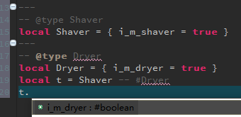

# tolua ldtdoc
An eclipse-ldt doclua generator for [ToLua#](https://github.com/topameng/tolua)  
I like eclipse lua development tools so did this.  
The generator is just a fancy regex matcher. Nothing special.  
Assuming you have an eclipse lua project already. Just place generated_doclua and doclua in build paths as follows:  
  
Then enjoy:  
  

# why eclipse
### type hinting

### custom type autocompletion support
http://wiki.eclipse.org/LDT/User_Area/Documentation_Language

# debugger
### 1. Modify some code to make debugger recognize unity loaded lua files:
change as follows in function **static int Loader(IntPtr L) ToLua.cs**
```csharp
/*if (LuaDLL.luaL_loadbuffer(L, buffer, buffer.Length, fileName) != 0)*/
if (LuaDLL.luaL_loadbuffer(L, buffer, buffer.Length, "@" + fileName + ".lua") != 0)
```
### 2. Use the "Lua Attach to Application" configuration.
Export a dbgp debugger client from eclipse. And require it in your code when you start the debug session.
```lua
require("ldt_debugger")(nil,nil,nil,nil,nil,"path to your source code")
```
### 3. fix for debugger.lua(line number may not exactly as I said)
```lua
-- comment out this line if you don't want debugger exits unity when detach
  os.exit(1) -- line 379

-- comment out this line to fix debugger crash when inspect variables
   { tag = "context", attr = { name = "Global",  id = 1 } }, -- line 636
```