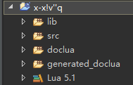
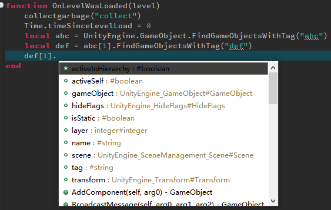

# tolua ldtdoc
An dclipse-ldt doclua generator for ToLua#  
I like eclipse lua development tools so did this.  
The generator is just a fancy regex matcher. Nothing special.  
Assuming you have an eclipse lua project already. Just place generated_doclua and doclua in build paths as follows:  
  
Then enjoy the autocomplete feature:  
  

# tolua for unity
https://github.com/topameng/tolua

# debugger
##### 1. Modify some code to make debugger recognize unity loaded lua files:
change as follows in function **static int Loader(IntPtr L) ToLua.cs**
```csharp
/*if (LuaDLL.luaL_loadbuffer(L, buffer, buffer.Length, fileName) != 0)*/
if (LuaDLL.luaL_loadbuffer(L, buffer, buffer.Length, "@" + fileName + ".lua") != 0)
```

##### 2. Use the "Lua Attach to Application" configuration.
Export a dbgp debugger client from eclipse. And require it in your code before you start the debug session.
```lua
require("ldt_debugger")(nil,nil,nil,nil,nil,"path to your source code")
```
