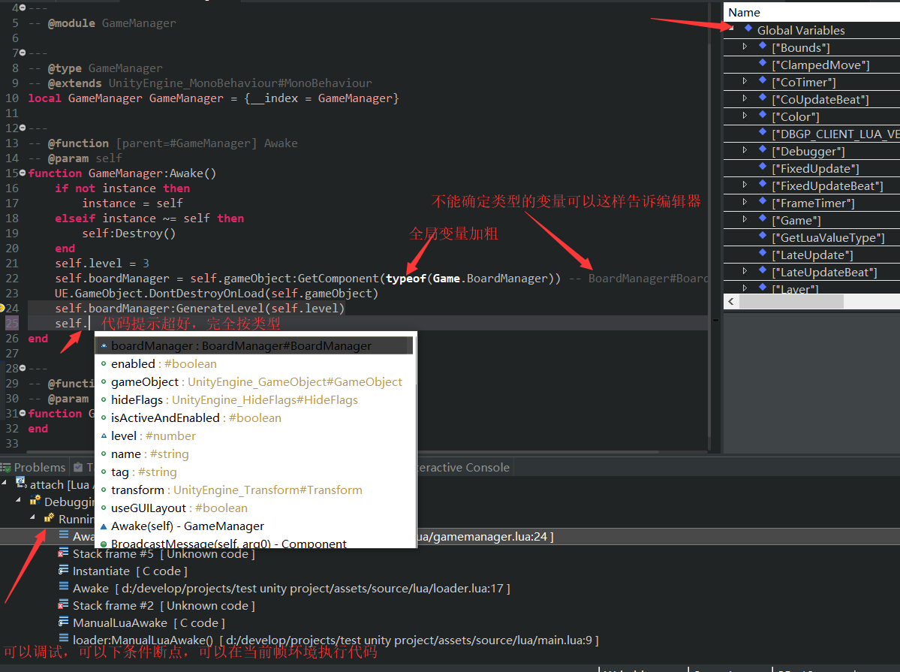

# tolua ldtdoc
An eclipse-ldt doclua generator for [ToLua#](https://github.com/topameng/tolua)  
With this tool, **Autocompletion** will work for Unity APIs.  
The generator is just a fancy regex matcher. Nothing special.  

# how to use
Assuming you have an eclipse lua project already.  
Just place generated_doclua and doclua in build paths as follows:  
  
Then enjoy:  
  

# why eclipse
### type hinting

### custom type autocompletion support
http://wiki.eclipse.org/LDT/User_Area/Documentation_Language

# debugger
### 1. make debugger recognize unity loaded lua files:
change LuaConst.cs, make openZbsDebugger = true, then apply [this patch](https://github.com/ps5mh/tolua/commit/5ed16e1975c157d3b6d8a843db5a7b528a5ab2fc)
### 2. use the "Lua Attach to Application" configuration.
export a dbgp debugger client from eclipse. And require it in your code when you start the debug session.
```lua
require("debugger")()
```
### 3. add these line on top of debugger.lua
```lua
-- fix for tolua# __tostring may return nil when inspect metatable, as did in static int Lua_ToString(IntPtr L)
-- fix for tolua# __tostring may crash when inspect metatable, as did in Vector2.__tostring
local tostring = function(s) local o,r = xpcall(tostring,function()end,s) return r or "[unknown in tolua]" end
-- don't exit app in lua
os.exit = function()end
-- debugger should be attached before System.coroutine, since debugger overrides coroutine.resume
-- or unload System.coroutine then load it again after debugger attached
```